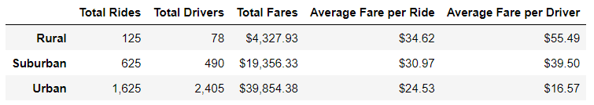

# PyBer_Analysis

## Overview

As a data analysit at a ride-sharing app company, I was tasked to perform an analysis to create a summary for studying the relationship between average weekly fare, number of rides and number of drivers in different city types (Urban, Suburban, Rural). The purpose of this analysis is to help the company to make decision for increading rideshare accessibility in undersrved neighborhoods.

## Results
In order to complete this task, using Python coding, I calculated the total rides, total drivers and total fares for each city type as well as the average fare per ride and the average fare per driver for each city type.At the end, to help better visualization the outcome, I created a multiple-line graph to show the weekly fares for each city type.

Based on the summary chart below, the total rides in Urban cities is more than Suburban and Rural and therefore more drivers are using the app in those cities and the total fares are higher. However, it can be seen that the average fare for each ride is about $10.00 higher in Rural cities compared to Urban city type and about $6.00 more in suburban cities in comparison with urban city type. Moreover, the average fare for each driver is highest respectively for rural, suburban and urban cities. 

Additionaly, based on the weekly summary of total fares for each city type Rural has the lowest after Suburban and Urban cities. 

## Summary
Considering this information and the purpose of the analysis being to make the ride-share services more affordable in underserved neighborhoods, my suggestions are as follow:
1) To lower the cost of each fare per ride by having more people as drivers in rural city types. This will result in more total rides and more total fares while lowering the average fare per ride.This will also lower the average fare per deriver which is 3.3 times more in rural cities compared to urban cities and can be lowered considerably.
2) To help the drivers in Urban cities, I recommend lowering the number of drivers so that the average fare per driver will be higher considering the expenses of living in urban neighborhoods. This will also bring more interest for drivers to use PyBer platform compared to competitors.
3) Another approach can be increasing the fare charged in urban cities so that the drivers are payed more without losing any of them. People can afford more in urban cities and this can help drivers to get payed more.
